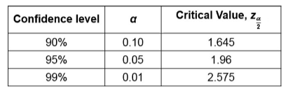

# Chapter-7

[StatCrunch_CH7](College/STAT_2050/1712163278-statcrunchch7.md)

## 7.1 Estimating A Population Proportion

- **Point Estimate** - a single value estimate of a population parameter

### Margin of Error

$$ E = z \times \sqrt{\frac{\hat{p}\hat{q}}{n}} $$

Where:

- $\hat{p}$ is the sample proportion
- $\hat{q}$ is $1-\hat{p}$
- $n$ is the sample size
- $z$ is the critical value

### Critical Value

A Critical value is the number on the borderline separating samples that are significantly low or high

The number $z_\frac{a}{2}$ is the critical value that corresponds to a given level of confidence.

## Confidence Interval and $\alpha$

in order to find $E$ we need to know the confidence level

- **Confidence Level** - the probability that the interval estimate will contain the population parameter, assuming that the estimation process is repeated a large number of times.

$\alpha$ is the probability that the interval estimate will not contain the population parameter.

### Common Critical Values

## 7.2 - Estimating Parameters and Determining Sample Sizes

### Estimation when $\sigma$ is known

If we know the value of the population std dev $\sigma$, The confidence interval is constructed using a normal distribution, along with this margin of error.

$$ E=\frac{\sigma}{\sqrt{n}}\times z $$

### Finding a point estimate and margin of error from a CI

Point Estimate of $\mu

$$ \bar{x} = \frac{\text{Lower Confidence} + \text{Upper Confidence}}{2} $$

Margin of Error

$$ E = \frac{\text{Upper Confidence} - \text{Lower Confidence}}{2} $$

### t Distribution

- unimodal and symmetric
- bell shaped
- changes according to the sample size
- approaches the normal model as the sample size increases

### Estimation when $\sigma$ is unknown

Margin of Error

$$ E = \frac{s}{\sqrt{n}} \times t $$

Degrees of Freedom = $n-1$

Critical Value = $t_{\alpha/2}$

## Sample Size Determination

$$ n = \left( \frac{z \times \sigma}{E} \right)^2 $$
