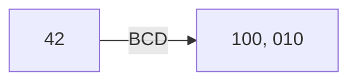

# X86 Architecture

## Goals

- _Malware Analysis_: the understanding and examination of information necessary to respond to a network intrusion.
- _Assembly Language_: a low-level programming language that is a human-readable representation of machine language
- _Host-based Signature_: indicators which can identify files created or edited by infected code which can make hidden changes to a computer's registry
- _Network-based Signature_: indicators inside of network traffic that can identify infected systems, WireShark is often used in this process

To begin reverse engineering malware, malware analysis must be used in order to break-down the binary, find it on a network, and contain it. In order to understand the nature of the malware, specifically what it has done to the files, host-based signatures must be developed. Using these signatures, they must also be used to detect infections throughout a network by creating network-based signatures.

It is easy to confuse host-based signature creation with antivirus signatures, but while an AV is concentrating on the effect of the malware on the machine, host-based signatures are concentrating on the make-up of the malware that makes it detectable in other systems.

Network signatures involve the network traffic to find where a malware is hiding. This is done by examining the traffic and finding the malware in the network traffic.

Upon finding the signatures and finding the amount of infection, the next step is to find out what the malware is doing.

## Techniques

- _Static Analysis_: the analysis of malware without executing it
- _Dynamic Analysis_: the analysis of malware by executing it in a controlled environment
- _Disassembler_: a tool that translates machine code into assembly code
- _Debugger_: a tool that allows the user to execute a program one line at a time

When analyzing malware, static analysis is used to examine the file without executing it. This is done to avoid any potential damage to the system. Dynamic analysis is used to execute the malware in a controlled environment to see what it does. Reverse Engineering is more that just analysis, using data found, exploiting malware is the ultimate goal to contain malware infections and ultimately remove threats.

## Types of Malware

- _Backdoor_: a hidden entry to a computer system
- _Botnet_: allows an attacker to access many systems at once
- _downloader_: a program that downloads other programs
- _Keylogger_: a program that records keystrokes
- _Rootkit_: a program that hides itself and other programs
- _Scareware_: a program that tricks the user into thinking they are infected
- _Worm/Virus_: a program that spreads itself to other systems

# x86 Assembly

x86 assembly language is a family of backward-compatible assembly languages, which provide some level of compatibility all the way back to the Intel 8008. x86 assembly language is used to develop software for the x86 architecture.

x86 has two syntaxes, Intel and AT&T. The AT&T syntax is the syntax mainly used by Unix, the Intel syntax is mainly used in MS-DOS and Windows. The syntax is different, but the instructions are the same.

the main difference between the two is that in the AT&T syntax, the source comes before the destination and vice-versa in the Intel syntax.

## Transistors and Memory

- _Transistor_: small crystals of silicon that act as switches
- _diodes_: a semiconductor device with two terminals, typically allowing the flow of current in one direction only.
- _Capacitors_: a device used to store an electric charge, consisting of one or more pairs of conductors separated by an insulator.
- _Memory Cell_: a unit of memory that can store a single bit of data

Computers are, at the base, made out of transistors. when you zoom out, you get diodes and capacitors. Adding all of these together you can create a memory cell.

a memory cell keeps a minimum current flow so that when voltage is put through its input and select pin, a signal is given on its output pin. So the presence of voltage represents a 1, while the lack of voltage is a 0.

## Bytes, Words, and Dwords

- _byte_: 8 bits
- _word_: 2 bytes
- _dword_: 4 bytes
- _Memory Address_: a unique identifier for a memory cell

Every byte in a computer has a unique address, each memory address is expressed as a double word hexadecical value. This is because a byte is 8 bits, and a word is 16 bits, and a dword is 32 bits.

## The Basic Architecture

The basic building blocks of a computer application is machine instructions stored in memory.

The CPU consists of 4 parts:

1. Control Unit - Retrieves and decodes instructions from the CPU and then storage and retrieval
2. Execution Unit - Were execution occurs
3. Register - Internal CPU memory locations
4. Flags - Indicates events upon execution

The basic "thought process" of a CPU is as follows:

1. read from the beginning of the program.
2. after reading the first Dword in memory, it executes the procedure that the instruction says
3. The next machine instruction is processed, the location of this instruction is dictated by the EIP
4. Rinse and Repeat until the end

Of course, a vulnerability is shown here because if you control EIP, you control the CPU.

All of this executes along with the system clock, an oscillator that emits square wave pulses in precise intervals

## Registers

- _Register_: temporary places to store data on the processor.
- _DS Segment_: a segment of memory that is used to store data

Registers are generally 32-bits of data, some are general purpose while others serve a specific purpose

- EAX: Main Accumulator, used for arithmetic operations
- EBX: Base Register, used as a pointer to data in the DS Segment
- ECX: Counter Register, used for loop control
- EDX: Data Register, used for I/O operations, can be used for arithmetic operations along with eax
- ESI: Source Index, used as a pointer to the source in string operations
- EDI: Destination Index, used as a pointer to the destination in string operations
- EBP: Base Pointer, used to point to the base of the stack
- ESP: Stack Pointer, used to point to the top of the stack

EAX, EBX, ECX, and EDX can have the lower 2 bytes referenced as AX, BX, CX, and DX respectively. The lower 2 bytes of EAX can be referenced as AL, and the higher 2 bytes can be referenced as AH.

Also, ESI,EDI,EBP, and ESP can be referenced as SI, DI, BP, and SP respectively. this returns their 16-bit equivalent

## Segment Registers

Segment registers are for referncing memory locations, there are sig segment registers

- CS: Code segment register, stores the base location of the code secntion (.text)
- DS: Data segment register, stores the base location of the data section (.data)
- SS: Stack segment register, stores the base location of the stack section (.stack)
- ES: Extra segment register, used for string operations
- FS: Extra segment register, used for string operations
- GS: Extra segment register, used for string operations

Each segment is 16-bits and contains a pointer to the start of the memory specific segment

No program can explicitly load or change the value of the CS register, the CS register is loaded by the operating system when the program is executed.

DS,ES,FS, and GS can be loaded with a new value using the MOV instruction, these registers help to ensure that data does not overlap.

SS is for the stack.

## Instruction Pointer

EIP is one of the most important registers in reverse enginnering. It keeps track of where the program is, if you can control EIP, you control the program flow.

This is a simple hello world program, with GDB you can see where EIP is

The `=>` symbolizes where EIP is and where the next instruction will be.

There is a way to hack this

This is the unreachable function, so if we set EIP to the starrt of the function it will run that.

## Control Registers

Control registers determine the operating mode of the CPU

1. CR0: System Flag that sets the operating mode
2. CR1: NCI
3. CR2: Memory page fault info
4. CR3: Memory page fault info
5. CR4: Flags that enable features of the processor

These cannot be called directly, but the value can be moved into a general purpose register and then later moved to the CR.

These registers allow a programmer to query what a processor's capabilities are.

## Flags

flags help control, check, and verify program execution and they determine whether each operation performed by the processor is valid.

With 32-bit assembly, there is a single register which contains a group of status, contol, and system flags. This is EFLAGS

Status Flags:

1. CF: Carry Flag
2. PF: Parity Flag
3. AF: Adjust Flag
4. ZF: Zero Flag
5. SF: Sign Flag
6. OF: Overflow Flag

The carry flag is set when math is being done on an unsigned integer value and it creates a carry or borrow for the most significant bit. This overflows the register which results in an incorrect operation.

The parity flag is for corrupt data is detected as a result of a math operation. When checked, it is set if the number of 1 bits is even and it is cleared if it is odd.

The adjust flag is set if carry or borrow operation occurs from bit 3 of the register used for the calculation, it is used in Binary Coded Decimal math.

> BCD is different from regular math because each digit is represented by itself in binary

The zero flag is set if the result is zero.

The sign flag is set to the significant bit of the result which is the sign bit, whether or not the result is positive or negative.

The overflow flag is for signed integer arithmetic, essentially the same as the carry flag but it can also check when a negative number is too small for the register[1]

[1]: remember the smaller a negative number the more bits it needs, it does not mean how close it is to zero, but rather how far away.

The control flags are to control the processor, the DF flag controls which way strings are handled by the processor.

System flags are for OS level operations, these should NEVER be modified by any program or application.

TF: Trap Flag
IF: Interrupt Enable Flag
IOPL: I/O Privilege Level Flag
NT: Nested Task Flag
RF: Resume Flag
VM: Virtual-8086 Mode Flag
AC: Alignment Check Flag
VIF: Virtual Interrupt Flag
VIP: Virtual Interrupt Pending Flag
ID: Identification Flag

Trap flag is for single step mode, where the processor only goes one instruction at a time and then waits for the signal to perform the next instruction.

Interrupt enable controls the reaction of external signals

I/O priv defines access levels for the address space.

nested task controls whether the currently running task is linked to the previous task

resume controls the processor's reaction when debugging

VM flag is for virtual-8086 mode, protected, or real mode.

alignment chack flag is used with the AM bit in CR0 to enable alignment checking

virtual Interrupt replicates the IF when the processor is in virtual mode.

VIF is another virtual mode to indicate that n interrupt is pending

IF is for whether the processor suuports CPUID instructions

## The Stack

The stack is the contiguous section of memory set aside for a program.

the stack pointer points to the top of the stack, so anything smaller than SP is considered trash / garbage data.

The Stack grous downwards, so there is an address, the stack limit, which signifies the lowest memory address of the stack, if the ESP goes lower than this, it can cause a stack overflow.

The stack can push or pop, you can push a register onto the the stack by subtracting four times the number of registers to be pushed from the ESP and then pushing the registers onto the stack.

$$ ESP = ESP - 4\times num_registers $$

you can pop by copying the data from the stack to the registers and then adding to the stack pointer. same deal as above but inverse.
